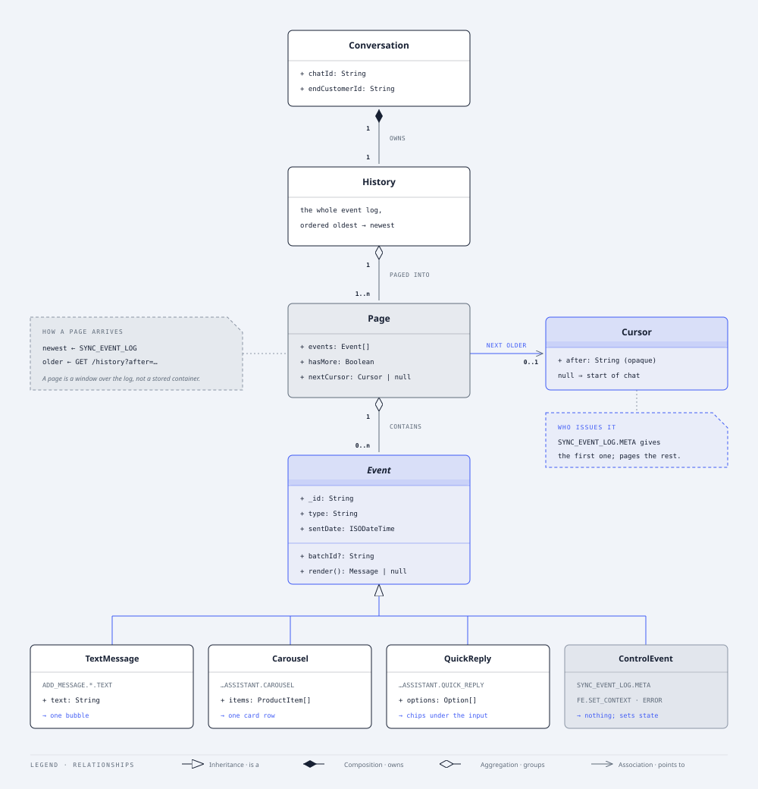
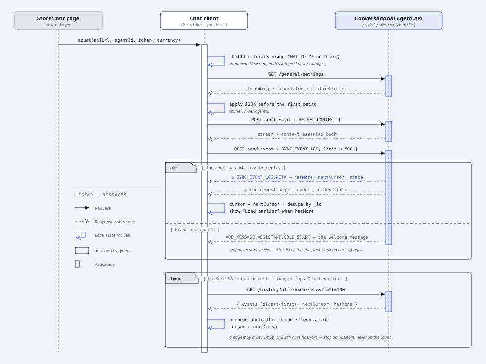

[← Back to Getting Started](README.md)

# 2. How the chat integration works

## Storefront and chat client

The web experience is composed of **two layers**. The **outer layer** is the merchant's own storefront page — for example a product-detail page (PDP), a product-listing/category page (PLP), or a search-results/autosuggest surface — which defines the [context](05-advanced-cases.md#set-context-both). The **inner layer** is the Conversational Agent chat client UI that floats on top of it, and is everything documented in this guide.

The chat client itself has **two main views**. The **Welcome view** is the blank-slate state shown before the shopper says anything — it presents the agent's branding and a few actionable **conversation starters** to invite the first message. The moment a message is exchanged, the chat client switches to the **Active chat view**, a scrollable thread that renders every assistant and user turn: text replies, streaming chunks, product carousels, and quick-reply suggestions.

**Conversation starters** are pre-chat suggestion chips fetched from public Clarity Search endpoints — tuned to whatever the shopper is looking at (a product page, a listing page, or a search query). Selecting one simply sends its text as the first user message. See [Chapter 6 · Conversation Starters](06-conversation-starters.md) for the endpoints and payloads.

Throughout, the assistant relies on **context**: a snapshot of what is shown in the outer storefront page (product IDs, cart contents, active category or filters, and currency). Keeping this in sync is what lets replies stay relevant — e.g. answering "is it waterproof?" about the exact product on screen. Context is pushed to the backend whenever the page or cart state changes via the [`FE.SET_CONTEXT`](05-advanced-cases.md#set-context-both) event.

The two wireframes below show each view as the chat client docked inside the outer storefront layer, and label which event drives each region and in which direction it flows.

### Welcome view — before the first message

Outer layer: the storefront page (PDP / PLP / search). Inner layer: the Conversational Agent chat client, showing branding + starter questions before any chat turn.


| Region | Event | Direction |
|---|---|---|
| Agent Logo (header) | `GET general-settings` | Inbound |
| Agent name & description | `GET general-settings` | Inbound |
| New chat | `SYNC_EVENT_LOG` (new `chatId`) | Outbound |
| Close chat | UI only — no event | — |
| Agent Logo (large, welcome) | `GET general-settings` | Inbound |
| Welcome message | `ADD_MESSAGE.ASSISTANT.COLD_START` | Both |
| Starter questions 1–3 | Conversation Starters → `ADD_MESSAGE.USER.TEXT` | Inbound |
| Chat input box | `ADD_MESSAGE.USER.TEXT` | Outbound |

### Active chat — messages, carousel & suggestions

Outer layer: the same storefront page. Inner layer: the Conversational Agent chat client mid-conversation — every bubble is a projection of one inbound / outbound event.


| Region | Event | Direction |
|---|---|---|
| User message | `ADD_MESSAGE.USER.TEXT` | Outbound |
| Assistant reply | `ADD_MESSAGE.ASSISTANT.TEXT` (+ `APPEND_LAST_ASSISTANT_MESSAGE`) | Inbound |
| Product carousel | `ADD_MESSAGE.ASSISTANT.CAROUSEL` | Inbound |
| Assistant follow-up | `ADD_MESSAGE.ASSISTANT.TEXT` | Inbound |
| Quick reply chips | `ADD_MESSAGE.ASSISTANT.QUICK_REPLY` | Inbound |
| Progress notification | `ADD_MESSAGE.ASSISTANT.NOTIFICATION` | Inbound |
| Chat input box | `ADD_MESSAGE.USER.TEXT` | Outbound |

Conceptually the chat client is a header, a scrollable message thread, and a message input. Everything the thread shows is derived from the ordered event log — each event type maps to one renderer.

## Chat client layout

Three regions:

- **Header** — assistant logo/avatar, name, description (from `general-settings`), plus actions (new chat, close).
- **Thread** — the message list rendered from the event log; implement auto-scroll to the newest message if that is desired for your UI.
- **Message input** — text input, optional footer quick-reply chips, and file/voice affordances.

The thread is a pure projection of an ordered event array keyed by `_id`. Rendering is a switch on `event.type`. The following chapters describe each event type.

## Domain model

How the pieces above relate. A conversation owns one history — the whole event log, ordered oldest to newest. That log reaches the client one **page** at a time, and each page carries its events plus, unless it has already reached the start of the chat, the cursor addressing the next older page.



A page is a window over the log, not a stored container. The newest one arrives as the answer to `SYNC_EVENT_LOG`, and is the only one you do not ask for by cursor; every older one is requested from the `history` endpoint with the cursor the previous page handed you. See [History paging](05-advanced-cases.md#history-paging-inbound).

Each event renders at most one message. Most produce a bubble in the thread; the rest supply state the client applies instead — the current context, the shopper's selection, and the paging fields on `SYNC_EVENT_LOG.META`. The thread therefore renders a subset of the log, which is what makes it a projection rather than a copy.

The four subtypes along the foot of the diagram are that switch, and each has its own chapter:

| Subtype | Renders as | Detail |
|---|---|---|
| `TextMessage` | one bubble in the thread | [User text](03-basic-events.md#user-text-message-outbound-echoed) · [Assistant text](03-basic-events.md#assistant-text-message-inbound) · [Quick-reply selection](05-advanced-cases.md#direct-call-outbound-echoed) |
| `Carousel` | one row of product cards | [Product carousel](04-rich-messages.md#product-carousel-inbound) |
| `QuickReply` | chips under the message input | [Quick replies](04-rich-messages.md#quick-replies-inbound) |
| `ControlEvent` | nothing — it sets client state, with one exception | [Set context](05-advanced-cases.md#set-context-both) · [Errors](05-advanced-cases.md#errors-inbound) |

That exception is `FATAL_ERROR`. It belongs to the control family but is the one member you must render: show the translated fallback message, stop the current stream, and let the shopper retry or start a new chat. Its sibling `ERROR` really is silent — backend telemetry, fine in a debug panel, never in the thread. See [Errors](05-advanced-cases.md#errors-inbound).

`QuickReply` is the one worth pausing on, because it is the only subtype that renders outside the thread. The assistant sends a list of suggested answers; you draw them as chips beneath the input, not as a bubble. They are input affordances rather than conversation, which is why picking one leaves no trace of the chips themselves — the selection goes back as an `ADD_MESSAGE.USER.DIRECT_CALL` carrying the chip's label, and it is that message which appears in the thread. See [Quick replies](04-rich-messages.md#quick-replies-inbound) for the payload and the exact rule for `target`/`payload`.


## From mount to history

The model above says what the pieces are; this section says how the client gets hold of them, and in what order. Three steps bring the client up: fetch branding, push context, then sync. The sync goes out every time — what comes back is what differs, a replayed page for a chat that has history and a cold-start welcome for a brand-new one. Everything older than that first page is then reached one cursor at a time.



| Step | Call | When |
|---|---|---|
| Resolve `chatId` | none — `localStorage` or a fresh UUID v7 | Every mount |
| [Branding & translations](README.md#step-1--fetch-branding--translations-inbound) | `GET general-settings` | Once per session, cached 6 h |
| [Current context](05-advanced-cases.md#set-context-both) | `FE.SET_CONTEXT` via `send-event` | Every mount, then on every page / cart change |
| [History restoration](05-advanced-cases.md#history-restoration-outbound) | `SYNC_EVENT_LOG` via `send-event` | Every mount and every **New chat** — a fresh `chatId` gets a cold start back |
| [Older pages](05-advanced-cases.md#history-paging-inbound) | `GET history?after=<cursor>` | While `hasMore`, behind **Load earlier messages** |

The `loop` frame is the `Page → Cursor` association from the domain model, walked backwards: every response hands back the cursor for the page before it, and `hasMore` — never the number of events returned — decides whether the button stays.

## The send-event channel

`POST /ca/v1/agents/{agentId}/chats/{chatId}/send-event`

```ts
// request body
{
  event: { _id, type, sentDate, … },
  url: "https://shop/pdp",   // required
  endCustomerId: "cookie",
  localeTime?, conversationId?,
  directToAgent?, agentPayload?
}
```

### One outbound event per request

For merchant integrations, send `event`, `url`, and `endCustomerId` on every request. The OpenAPI schema marks only `event` and `url` as strictly required, but omitting `endCustomerId` prevents stable shopper-level conversation tracking.

| Field | Description |
|---|---|
| `event` | The single event (discriminated union). |
| `url` | Current outer storefront page URL. |
| `endCustomerId` | Stable shopper/end-user identifier, usually a cookie value. |
| `directToAgent` / `agentPayload` | Skip routing and dispatch straight to a named agent. |

Some product-carousel events include `_metadata.queries`: the exact search queries the assistant used. There is no "See all results" button by default; if a merchant has configured one, pass those queries to your storefront search page so it can show the same result set. Treat other metadata fields, such as `engVer`, as diagnostic and do not render them to shoppers.

## Streaming responses

```ts
// server writes a growing JSON array
[
  {"type":"...NOTIFICATION",...},
  {"type":"...ASSISTANT.TEXT",...},
  {"type":"APPEND_...",...},
  {"type":"...CAROUSEL",...}
]  // ← ] closes the turn
```

### Parse a single growing array incrementally

The response body is one JSON array written character-by-character. Parse it as it arrives and render only newly received items.

```js
const reader = response.body.getReader()
let buffer = '', lastIndex = -1, parsed = []
for (;;) {
  const { done, value } = await reader.read()
  if (done) break
  buffer += decoder.decode(value)
  try { parsed = JSON.parse(buffer) }
  catch { try { parsed = JSON.parse(buffer + ']') } catch { continue } }
  while (lastIndex + 1 < parsed.length) await onItem(parsed[++lastIndex])
}
```

Try `JSON.parse(buffer)` (closed array), else `JSON.parse(buffer + ']')` (in-flight). When done, the final buffer must parse as a complete JSON array; one that does not is a turn the server truncated. Test that by parsing it — not by checking that it ends in `]`, which a cut after `[{"data":[]` also does.

**Keep what arrived, then check that something did.** Every event parsed before the cut has already been dispatched and rendered, so a truncated turn usually leaves the shopper holding a real, if short, reply. Log the truncation for your own telemetry, clear the progress indicator, re-enable the input, and show nothing further: an error message beneath a readable answer is a fault the shopper can neither act on nor tell apart from a genuinely brief reply.

Two truncations do need surfacing, because they leave you with nothing to keep. A turn cut before its first event renders no reply at all. A `SYNC_EVENT_LOG` cut before `SYNC_EVENT_LOG.META` leaves paging state unset, which hides the **Load earlier messages** button and presents a partial transcript as a complete one — the silent truncation [History paging](05-advanced-cases.md#history-paging-inbound) warns about. Treat both as a recoverable error and let the shopper retry.

> ⚠️ **Ignore event types you don't recognise.** The stream also carries internal event types that are deliberately left out of this contract, and new types may be added without that counting as a breaking change. Switch on `event.type` and make the `default` branch a no-op. This matters most for generated clients: a strict `oneOf`/discriminator deserializer (Go `ValueByDiscriminator`, Jackson `@JsonSubTypes` without a `defaultImpl`, and similar) will **throw** on an unmapped `type` unless you give it a fallback.

### One inbound event describes the response

`SYNC_EVENT_LOG.META` describes the sync response itself. It arrives first in the answer to `SYNC_EVENT_LOG` and reports whether older events remain (`hasMore`) and the cursor used to request them (`nextCursor`). Copy those fields into your paging state and discard the event — the thread is built from the events that follow it. See [History paging](05-advanced-cases.md#history-paging-inbound).

### Group events into one reply

One assistant reply can arrive as several events — a text message, then a carousel, then quick replies. `ADD_MESSAGE.ASSISTANT.TEXT`, `ADD_MESSAGE.ASSISTANT.CAROUSEL` and `ADD_MESSAGE.ASSISTANT.QUICK_REPLY` carry a `batchId` for exactly that: events sharing one are parts of the same reply, and two different values are two separate replies. Use it to render the first part as soon as it arrives while the rest still streams in, and to keep one reply's parts together — no separator or timestamp drawn through the middle of it.

`batchId` is optional. It is absent on every user event and on events recorded before it existed, so treat a missing value as "no grouping information", not as a new reply: fall back to grouping consecutive same-role events that arrive close together.

It groups whole events, which is independent of `APPEND_LAST_ASSISTANT_MESSAGE` streaming text into a single bubble.

## Request lifecycle — one in-flight at a time

### Disable input box while streaming

1. On submit, disable the message input and visible quick replies.
2. Show `staticReplies.notificationThinking` immediately.
3. Render incoming events; `NOTIFICATION` replaces the progress indicator in place.
4. When the stream completes (all response events received), clear the progress indicator and re-enable the input. If a `FATAL_ERROR` arrives, show the safe fallback error message and let the shopper try again or start a new chat.

> ⚠️ **Timeout:** the backend holds the connection up to **60 seconds**. Match it with an `AbortController` so a stalled stream can't lock the UI.

---

[← Chapter 1 — Getting Started](README.md) · [Chapter 3 — Basic event types →](03-basic-events.md)
