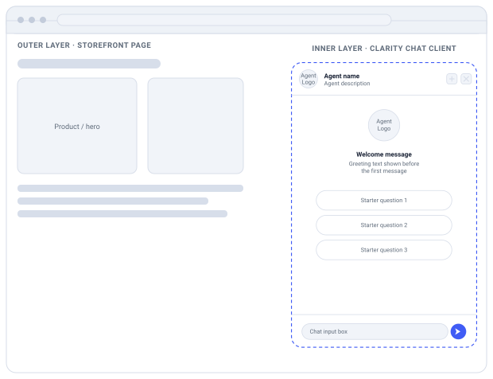
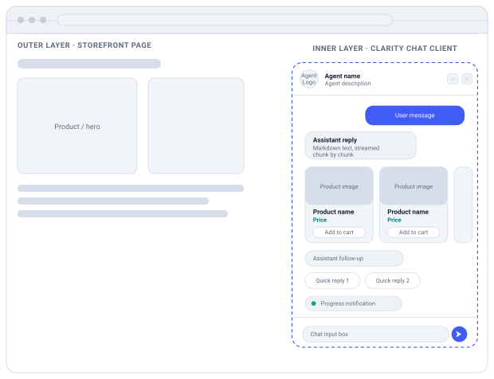

[← Back to Getting Started](README.md)

# 2. How the chat integration works

## Storefront and chat client

The web experience is composed of **two layers**. The **outer layer** is the merchant's own storefront page — for example a product-detail page (PDP), a product-listing/category page (PLP), or a search-results/autosuggest surface — which defines the [context](05-advanced-cases.md#set-context-both). The **inner layer** is the Conversational Agent chat client UI that floats on top of it, and is everything documented in this guide.

The chat client itself has **two main views**. The **Welcome view** is the blank-slate state shown before the shopper says anything — it presents the agent's branding and a few actionable **conversation starters** to invite the first message. The moment a message is exchanged, the chat client switches to the **Active chat view**, a scrollable thread that renders every assistant and user turn: text replies, streaming chunks, product carousels, and quick-reply suggestions.

**Conversation starters** are pre-chat suggestion chips fetched from public Clarity Search endpoints — tuned to whatever the shopper is looking at (a product page, a listing page, or a search query). Selecting one simply sends its text as the first user message. See [Chapter 6 · Conversation Starters](06-conversation-starters.md) for the endpoints and payloads.

Throughout, the assistant relies on **context**: a snapshot of what is shown in the outer storefront page (product IDs, cart contents, active category or filters, and currency). Keeping this in sync is what lets replies stay relevant — e.g. answering "is it waterproof?" about the exact product on screen. Context is pushed to the backend whenever the page or cart state changes via the [`FE.SET_CONTEXT`](05-advanced-cases.md#set-context-both) event.

The two wireframes below show each view as the chat client docked inside the outer storefront layer, and label which event drives each region and in which direction it flows.

### Welcome view — before the first message

Outer layer: the storefront page (PDP / PLP / search). Inner layer: the Conversational Agent chat client, showing branding + starter questions before any chat turn.



| Region | Event | Direction |
|---|---|---|
| Agent Logo (header) | `GET general-settings` | Inbound |
| Agent name & description | `GET general-settings` | Inbound |
| New chat | `SYNC_EVENT_LOG` (new `chatId`) | Outbound |
| Close chat | UI only — no event | — |
| Agent Logo (large, welcome) | `GET general-settings` | Inbound |
| Welcome message | `ADD_MESSAGE.ASSISTANT.COLD_START` | Both |
| Starter questions 1–3 | Conversation Starters → `ADD_MESSAGE.USER.TEXT` | Inbound |
| Chat input box | `ADD_MESSAGE.USER.TEXT` | Outbound |

### Active chat — messages, carousel & suggestions

Outer layer: the same storefront page. Inner layer: the Conversational Agent chat client mid-conversation — every bubble is a projection of one inbound / outbound event.



| Region | Event | Direction |
|---|---|---|
| User message | `ADD_MESSAGE.USER.TEXT` | Outbound |
| Assistant reply | `ADD_MESSAGE.ASSISTANT.TEXT` (+ `APPEND_LAST_ASSISTANT_MESSAGE`) | Inbound |
| Product carousel | `ADD_MESSAGE.ASSISTANT.CAROUSEL` | Inbound |
| Assistant follow-up | `ADD_MESSAGE.ASSISTANT.TEXT` | Inbound |
| Quick reply chips | `ADD_MESSAGE.ASSISTANT.QUICK_REPLY` | Inbound |
| Progress notification | `ADD_MESSAGE.ASSISTANT.NOTIFICATION` | Inbound |
| Chat input box | `ADD_MESSAGE.USER.TEXT` | Outbound |

Conceptually the chat client is a header, a scrollable message thread, and a message input. Everything the thread shows is derived from the ordered event log — each event type maps to one renderer.

## Chat client layout

Three regions:

- **Header** — assistant logo/avatar, name, description (from `general-settings`), plus actions (new chat, close).
- **Thread** — the message list rendered from the event log; implement auto-scroll to the newest message if that is desired for your UI.
- **Message input** — text input, optional footer quick-reply chips, and file/voice affordances.

The thread is a pure projection of an ordered event array keyed by `_id`. Rendering is a switch on `event.type`. The following chapters describe each event type.

## The send-event channel

`POST /ca/v1/agents/{agentId}/chats/{chatId}/send-event`

```ts
// request body
{
  event: { _id, type, sentDate, … },
  url: "https://shop/pdp",   // required
  endCustomerId: "cookie",
  localeTime?, conversationId?,
  directToAgent?, agentPayload?
}
```

### One outbound event per request

For merchant integrations, send `event`, `url`, and `endCustomerId` on every request. The OpenAPI schema marks only `event` and `url` as strictly required, but omitting `endCustomerId` prevents stable shopper-level conversation tracking.

| Field | Description |
|---|---|
| `event` | The single event (discriminated union). |
| `url` | Current outer storefront page URL. |
| `endCustomerId` | Stable shopper/end-user identifier, usually a cookie value. |
| `directToAgent` / `agentPayload` | Skip routing and dispatch straight to a named agent. |

Some product-carousel events include `_metadata.queries`: the exact search queries the assistant used. There is no "See all results" button by default; if a merchant has configured one, pass those queries to your storefront search page so it can show the same result set. Treat other metadata fields, such as `engVer`, as diagnostic and do not render them to shoppers.

## Streaming responses

```ts
// server writes a growing JSON array
[
  {"type":"...NOTIFICATION",...},
  {"type":"...ASSISTANT.TEXT",...},
  {"type":"APPEND_...",...},
  {"type":"...CAROUSEL",...}
]  // ← ] closes the turn
```

### Parse a single growing array incrementally

The response body is one JSON array written character-by-character. Parse it as it arrives and render only newly received items.

```js
const reader = response.body.getReader()
let buffer = '', lastIndex = -1, parsed = []
for (;;) {
  const { done, value } = await reader.read()
  if (done) break
  buffer += decoder.decode(value)
  try { parsed = JSON.parse(buffer) }
  catch { try { parsed = JSON.parse(buffer + ']') } catch { continue } }
  while (lastIndex + 1 < parsed.length) await onItem(parsed[++lastIndex])
}
```

Try `JSON.parse(buffer)` (closed array), else `JSON.parse(buffer + ']')` (in-flight). When done, the buffer must end with `]` or the stream is malformed.

> ⚠️ **Ignore event types you don't recognise.** The stream also carries internal event types that are deliberately left out of this contract, and new types may be added without that counting as a breaking change. Switch on `event.type` and make the `default` branch a no-op. This matters most for generated clients: a strict `oneOf`/discriminator deserializer (Go `ValueByDiscriminator`, Jackson `@JsonSubTypes` without a `defaultImpl`, and similar) will **throw** on an unmapped `type` unless you give it a fallback.

## Request lifecycle — one in-flight at a time

### Disable while streaming

1. On submit, disable the message input and visible quick replies.
2. Show `staticReplies.notificationThinking` immediately.
3. Render incoming events; `NOTIFICATION` replaces the progress indicator in place.
4. When the stream completes (all response events received), clear the progress indicator and re-enable the input. If a `FATAL_ERROR` arrives, show the safe fallback error message and let the shopper try again or start a new chat.

> ⚠️ **Timeout:** the backend holds the connection up to **60 seconds**. Match it with an `AbortController` so a stalled stream can't lock the UI.

---

[← Chapter 1 — Getting Started](README.md) · [Chapter 3 — Basic event types →](03-basic-events.md)
