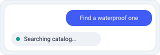
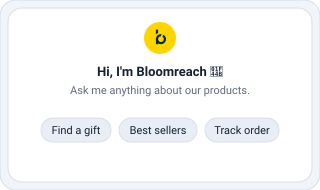

[← Back to How the chat integration works](02-how-the-chat-integration-works.md)

# 3. Basic event types (messages)

The everyday building blocks: the shopper's text, the assistant's text and its streaming chunks, the in-place progress indicator, and the welcome message.

## User text message `Outbound` (echoed)

`ADD_MESSAGE.USER.TEXT`


### The shopper types a message

```ts
{ _id: string,
  type: "ADD_MESSAGE.USER.TEXT",
  sentDate: string,              // ISO date-time
  text: string }
```

Right-aligned bubble. The server echoes this same event back on the turn — if you render optimistically, de-duplicate the echoed copy by `_id`.

Quick-reply selections do **not** use this event — they are always sent as `ADD_MESSAGE.USER.DIRECT_CALL` (see [Quick replies](04-rich-messages.md#quick-replies-inbound)), even when the option has no `target`/`payload`.

<br clear="right" />

## Assistant text message `Inbound`

`ADD_MESSAGE.ASSISTANT.TEXT`


### A complete (or starting) assistant message

```ts
{ _id: string,
  type: "ADD_MESSAGE.ASSISTANT.TEXT",
  sentDate: string,              // ISO date-time
  text: string,
  agent?: string,
  marker?: string,
  skipToneOfVoice?: boolean,
  product_id_link_mapping?: string[] }
```

Render as GitHub Flavored Markdown (links, tables, lists). It may be the seed that later `APPEND` chunks fold into. `product_id_link_mapping` helps rewrite inline product links to PDP URLs.

<br clear="right" />

## Streaming chunk `Inbound`

`APPEND_LAST_ASSISTANT_MESSAGE`


### Fold into the previous assistant bubble

```ts
{ _id: string,
  type: "APPEND_LAST_ASSISTANT_MESSAGE",
  sentDate: string,              // ISO date-time
  text: string }
```

Append `text` to the most recent `ASSISTANT.TEXT` bubble. If an `APPEND` arrives with no prior text message, start a new one from it.

```js
case 'APPEND_LAST_ASSISTANT_MESSAGE':
  if (lastAssistantMsg) { lastAssistantMsg.text += event.text; update() }
  else { lastAssistantMsg = {...event, type: 'ADD_MESSAGE.ASSISTANT.TEXT'}; append() }
```

<br clear="right" />

## Progress notification `Inbound`

`ADD_MESSAGE.ASSISTANT.NOTIFICATION`



### In-place progress update

```ts
{ _id: string,
  type: "ADD_MESSAGE.ASSISTANT.NOTIFICATION",
  sentDate: string,              // ISO date-time
  toolName: string,              // internal — DO NOT display
  text: string }                 // what the user sees
```

- **Show only `text`** — `toolName` is internal.
- **Replace, don't append** — one in-place element, not a bubble per notification.
- **Clear when the turn completes** — keep it visible while messages stream in; remove it only after the request finishes and all response events have been received.
- **Initial state** — show `notificationThinking` the moment the user submits; the first notification overwrites it.

<br clear="right" />

## Welcome / cold start `Both`

`ADD_MESSAGE.ASSISTANT.COLD_START`



### The blank-slate welcome screen

```ts
{ _id: string,
  type: "ADD_MESSAGE.ASSISTANT.COLD_START",
  sentDate: string,              // ISO date-time
  text: string,
  engText?: string,
  areCartProducts?: boolean,
  productIdsToShow?: string[],
  initialContext?: object,
  quickReply?: { label: string; target?: string; payload?: object }[] }
```

Rendered before the first real message. Carries a welcome `text`, optional starter `quickReply` chips, and products to show. This is the actual welcome message object saved for replay, but sending `ADD_MESSAGE.ASSISTANT.COLD_START` directly does not persist it in conversation history. Persist welcome state for replay by sending the outbound `PERSIST_COLD_START` event with the cold-start message in its `events` payload.

<br clear="right" />

---

[← Chapter 2 — How the chat integration works](02-how-the-chat-integration-works.md) · [Chapter 4 — Rich messages →](04-rich-messages.md)
