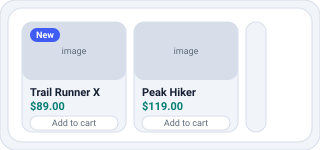
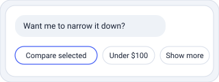
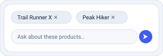

[← Back to Basic event types](03-basic-events.md)

# 4. Rich messages

Beyond plain text, the assistant emits structured product carousels, selectable quick replies, and selection state that ties into the message input's "compare" flow.

## Product carousel <sup>`Inbound`</sup>

`ADD_MESSAGE.ASSISTANT.CAROUSEL`



### A list of products

```ts
{ _id: string,
  type: "ADD_MESSAGE.ASSISTANT.CAROUSEL",
  sentDate: string,              // ISO date-time
  data: ProductItem[],           // required
  categoryName?: string,
  rephrasedQuery?: string,
  batchId?: string,              // one reply, many events
  _metadata?: { engVer?: string; queries?: string[] } }
```

Render product cards (image, title, price, tags, add-to-cart). There is no default "See all results" button; a merchant may optionally configure one to route shoppers to a storefront search page, using `_metadata.queries` to reproduce the result set.

**ProductItem:** `id` (required), `url`, `title`, `image`, `price`, `originalPrice`, `currency`, `description`, `variantAttributeList`, `questions`, `variants`, `__categories`, `extraVariantFields`. Format prices with the context currency when `currency` is omitted.

<br clear="right" />

## Quick replies <sup>`Inbound`</sup>

`ADD_MESSAGE.ASSISTANT.QUICK_REPLY`



### Selectable suggestion buttons

```ts
{ _id: string,
  type: "ADD_MESSAGE.ASSISTANT.QUICK_REPLY",
  sentDate: string,              // ISO date-time
  data: {                        // required
    label: string,
    target?: string,
    payload?: object
  }[],
  text?: string,
  batchId?: string }             // one reply, many events
```

> **On select:** always send an `ADD_MESSAGE.USER.DIRECT_CALL` with the `label` as `text`, regardless of the `target`/`payload` value. When the option carries a `target`/`payload`, copy it **verbatim**; when it does not, still send `DIRECT_CALL` with just the `label` (never `USER.TEXT`).

<br clear="right" />

## Selected items <sup>`Both`</sup>

`SELECTED_ITEMS`



### The shopper picked items (e.g. from a carousel)

```ts
{ _id: string,
  type: "SELECTED_ITEMS",
  sentDate: string,              // ISO date-time
  ids: string[],                 // required
  data?: ProductItem[],
  generatedFromAI?: boolean,     // true when created by the assistant
  isSelectedFromLastBotResponse?: boolean }
```

Drives the "compare" chips above the message input. Sent outbound when the user selects; also replayed inbound to restore selection state. Same object both directions.

<br clear="right" />

---

[← Chapter 3 — Basic event types](03-basic-events.md) · [Chapter 5 — Advanced cases →](05-advanced-cases.md)
