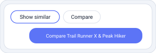
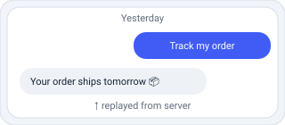
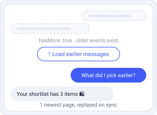
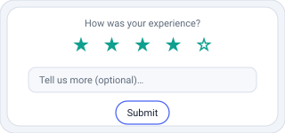
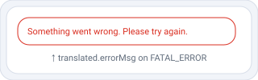

[← Back to Rich messages](04-rich-messages.md)

# 5. Advanced cases

Direct calls triggered by quick replies, context synchronization, history restoration and paging, feedback, and error handling. These power the richer flows and keep the UI in sync with the backend.

## Direct call <sup>`Outbound`</sup> (echoed)

`ADD_MESSAGE.USER.DIRECT_CALL`

```
target ─ <server-provided string>

// copied verbatim from the quick-reply
// option Clarity sent — never invented
// or hardcoded by the client
```

### Return a server-provided quick-reply target

```ts
{ _id: string,
  type: "ADD_MESSAGE.USER.DIRECT_CALL",
  sentDate: string,              // ISO date-time
  target?: string,
  source?: string,
  text?: string,
  invisible?: boolean,
  payload?: object }
```

Sent for **every** quick-reply selection — always `DIRECT_CALL`, never `USER.TEXT` — whether or not the option carries a `target`/`payload`. The client should not invent targets; copy any server-provided `target`/`payload` back **verbatim**, preserving unknown fields. `invisible: true` hides it from history.

> **Public integration rule:** treat `target` values as server-owned routing hints. Your client should only return values it received from Clarity in a quick reply; do not hardcode or expose an independent picker of backend targets.

## Built-in button action <sup>`Outbound`</sup> (echoed)

`ADD_MESSAGE.USER.GEN_BY_BTN` · `ADD_MESSAGE.USER.COMPARE`



### API event sent after selecting a built-in UI action

```ts
{ _id: string,
  type: "ADD_MESSAGE.USER.GEN_BY_BTN",
  sentDate: string,              // ISO date-time
  text: "SHOW_SIMILAR" | "COMPARISON",
  label?: string }

// replay-only:
{ _id: string,
  type: "ADD_MESSAGE.USER.COMPARE",
  sentDate: string,              // ISO date-time
  ids: string[] }
```

`GEN_BY_BTN` is the API event for a small set of built-in actions such as "show similar" or "compare". The UI label can be shopper-friendly, but the event text carries the fixed intent value expected by the backend. Like other user events, it is echoed back on the turn — de-duplicate the streamed copy by `_id`. `COMPARE` is a replay-only user event surfaced during history restoration.

## Set context <sup>`Both`</sup>

`FE.SET_CONTEXT`

```ts
// tell the assistant what's on screen
{
  currentItemIds: ["prod-123"],
  currentItemIdsType: "product_id",
  cartItemIds: […],
  currency: "USD",
  plpCategoryName?, miniPageProduct?,
  remove?: ["pageList", …]
}
```

### Sync the shopper's current view

```ts
{ _id: string,
  type: "FE.SET_CONTEXT",
  sentDate: string,              // ISO date-time
  currentItemIds?: string[],
  currentItemIdsType?: "product_id" | "item_id",
  currentItemId?: string,
  cartItemIds?: string[],
  miniPageProduct?: ProductItem,
  userContextFilter?: object,
  currency?: string,             // ISO 4217, e.g. "USD"
  plpCategoryName?: string,
  plpCategoryDescription?: string,
  urlQueryParams?: object,
  remove?: string[],
  uid?: string }
```

Send whenever page / cart / filter state changes so responses stay relevant. Pass the FE-configured `currency` here. Use `remove` to clear previously sent context groups, such as page-list or cart state. The server may also assert context state back with the same object — apply it to local state.

## History restoration <sup>`Outbound`</sup>

`SYNC_EVENT_LOG` · `PERSIST_COLD_START`



### Replay past events

```ts
{ _id: string,
  type: "SYNC_EVENT_LOG",
  sentDate: string,              // ISO date-time
  lastProcessedEventId?: string,
  welcomeUnnecessary?: boolean,
  limit?: number }               // default 500, max 500
```

Send on initial mount and after every **New chat**, for a brand-new `chatId` as well as an existing one. Reopening a chat replays its past events back through the response stream — including user messages; de-duplicate by `_id` since they may already exist locally. A brand-new `chatId` has nothing to replay, and the server answers with the `ADD_MESSAGE.ASSISTANT.COLD_START` welcome message instead, which is the only way that message arrives.

`limit` caps how many of the **newest** events come back. A long conversation is not replayed in full: the server clamps that page to 500 events, and everything older is reached through [history paging](#history-paging-inbound) below. Ask for less than the default if your UI only renders the last few turns on open — a smaller page is faster to paint, and nothing is lost as long as you page.

`PERSIST_COLD_START` stores welcome-screen events so they can be replayed later. Use it to persist the `ADD_MESSAGE.ASSISTANT.COLD_START` welcome message; sending the cold-start event itself does not save it.

## History paging <sup>`Inbound`</sup>

`SYNC_EVENT_LOG.META` · `GET …/chats/{chatId}/history`



A sync replays one **page**, not the whole chat — the newest page, and the only one you do not ask for by cursor. Older pages are retrieved from the `history` endpoint, and `SYNC_EVENT_LOG.META` provides the cursor to the first of them.

> ⚠️ **A truncated transcript looks exactly like a complete one.** If you ignore `SYNC_EVENT_LOG.META`, a shopper reopening a long conversation silently sees only its tail, with no indication that anything is missing. Read `hasMore` on every sync.

### The sync-response descriptor

```ts
{ _id: string,
  type: "SYNC_EVENT_LOG.META",
  sentDate: string,              // ISO date-time
  hasMore: boolean,
  nextCursor: string | null,
  state: { selectedList, selectedList_generatedFromAI,
           lastUserSelectedList } | null,
  stateAsOfSentDate: string | null }
```

Arrives **once, before the replayed events**, and only in answer to `SYNC_EVENT_LOG`. It belongs to your paging state: read `hasMore`, `nextCursor` and `state` from it, then discard it. Sync responses are its only carrier — every event in a `history` page is a chat-log entry.

- **`hasMore`** — older events exist beyond this page. Show or hide your **Load earlier messages** button on this, never on how many events arrived.
- **`nextCursor`** — opaque cursor to the page just before this one. Pass it back verbatim; `null` means the sync already reached the start of the chat.
- **`state`** — the shopper's selection state folded over the **whole** chat, which a client holding only one page cannot recompute from the events it holds. A snapshot from when the sync was served: restore UI from it on load, but don't keep deciding on it mid-conversation.
- **`stateAsOfSentDate`** — anchors that snapshot in time. `SELECTED_ITEMS` events older than this are already folded into `state`; ones that arrive after it still need applying.

### Load an older page

`GET /ca/v1/agents/{agentId}/chats/{chatId}/history?after=<cursor>&limit=100`

```ts
// response
{ events: HistoryEvent[],        // oldest-first, prepend above the thread
  nextCursor: string | null,
  hasMore: boolean }
```

`after` is **required**. The endpoint only traverses backwards from a position the client already holds, so there is no request for an initial page. Obtain the first cursor from `SYNC_EVENT_LOG.META`, then follow `nextCursor` from each response. A cursor the API did not issue is rejected with `400`; it does not fall back to the newest page.

```js
const loadOlder = async () => {
  if (!cursor) return                       // start of chat reached
  const res = await fetch(
    `${apiUrl}/ca/v1/agents/${AGENT_ID}/chats/${chatId}/history` +
    `?after=${encodeURIComponent(cursor)}&limit=100`,
    { headers: { 'Authorization': `Bearer ${API_TOKEN}` } })
  const page = await res.json()
  prependToThread(page.events)              // oldest-first, already in order
  cursor = page.nextCursor
  setLoadMoreVisible(page.hasMore)
}
```

Events come back **oldest-first**, the same order a sync replays them in, and the whole page is older than everything you already hold — so prepend it above the existing thread rather than appending. De-duplicate by `_id` as usual, and preserve the shopper's scroll position when you prepend.

> **Use `hasMore` to determine whether to continue, not the number of events returned.** A response may contain fewer events than `limit`, including none, while older history remains, because events are filtered after the page is selected. Stop paging only when `hasMore` is `false` or `nextCursor` is `null`.

`limit` defaults to 100 and is clamped to 500. Prefer several small pages: every carousel in a transcript carries its full product payload.

## Feedback <sup>`Outbound`</sup>

`ADD_MESSAGE.USER.FEEDBACK`



### Rate a response or the conversation

```ts
{ _id: string,
  type: "ADD_MESSAGE.USER.FEEDBACK",
  sentDate: string,              // ISO date-time
  score?: number,
  text?: string,
  messages?: string[] }
```

Powers both per-message thumbs up/down and the survey overlay. `score` is the rating, `text` the optional free-text, `messages` the message IDs being rated.

## Errors <sup>`Inbound`</sup>

`ERROR` · `FATAL_ERROR`



### Error events

```ts
{ _id?: string,
  type: "ERROR" | "FATAL_ERROR",
  sentDate?: string,             // ISO date-time
  text?: string,
  exception?: object,
  request?: object }
```

> **`ERROR`** — backend telemetry, **not user-facing**. Ignore in the UI (a debug panel is fine). The stream continues normally.

> 🛑 **`FATAL_ERROR`** — show `translated.errorMsg` (never `event.text`), stop the current stream, and allow the shopper to try again or start a new chat.

---

[← Chapter 4 — Rich messages](04-rich-messages.md) · [Chapter 6 — Conversation starters →](06-conversation-starters.md)
